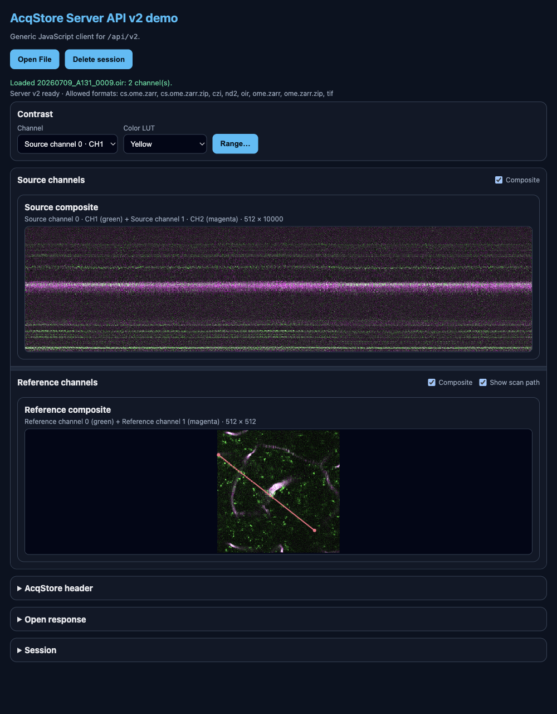

# Built-in demo

The packaged app ships a small HTML/JavaScript demo. With the app running, open it from the status window (**Open demo**) or go to:

```text
http://127.0.0.1:8767/demo/v2/
```



The screenshot may lag behind the latest UI; the steps below match the current page.

## What it does

1. Checks health and capabilities (shows ready status and allowed formats).
2. Lets you **Open File** (native dialog on the machine running the app).
3. Loads and displays **source (primary)** image planes.
4. When present, loads **reference** image planes and can overlay the reference **scan path** (**Show scan path**, on by default).
5. Provides shared **Contrast** controls (channel target, color LUT, Range histogram / min / max / Auto). Contrast is display-only and does not change server data.
6. Shows the **AcqStore header**; **Session** and **Open response** JSON are available in collapsed sections.
7. Opening another file replaces the previous demo session; **Delete session** clears the current one when you are done.

Supported file types come from AcqStore at runtime. Prefer `GET /api/v2/capabilities` over hard-coding extensions (typical examples include `.tif`, `.oir`, `.czi`, `.nd2`, and OME-Zarr variants).

## Source in this project

The demo page lives in this repository at:

```text
src/acqstore_server/static/demo/v2/index.html
```

More technical notes: [Reference demo](../reference/demo.md). To build your own page, start with [Build a client](../llm/build-a-client.md).
