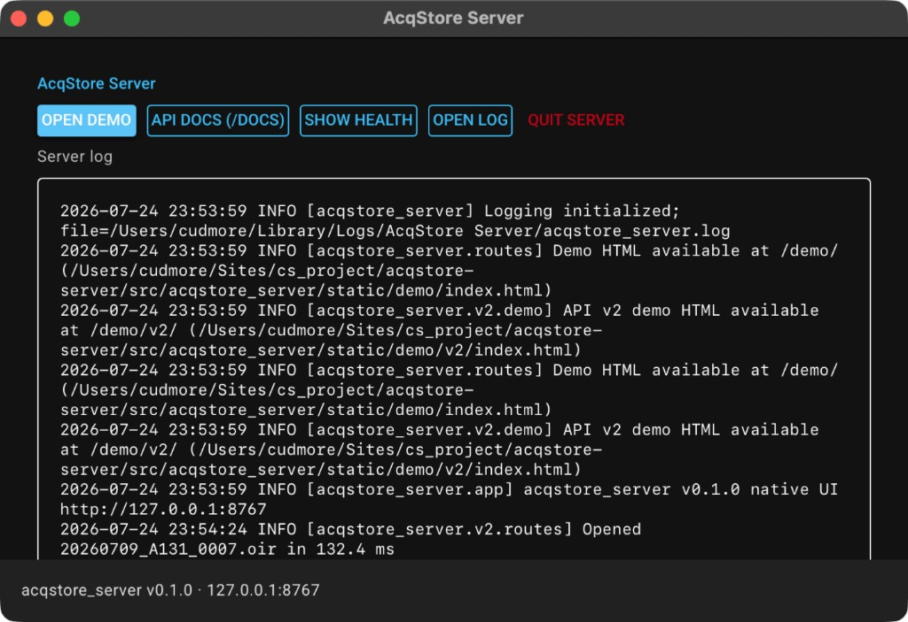

# Status window

When you start the packaged app, a small status window stays open while the local server is running.

## Header

The top row shows **AcqStore Server**, the app version, and **Documentation** (opens the public MkDocs site at [https://mapmanager.github.io/acqstore-server/](https://mapmanager.github.io/acqstore-server/)).

## Buttons

| Button | What it does |
|---|---|
| **Open demo** | Opens the built-in browser demo at `http://127.0.0.1:8767/demo/v2/` |
| **API docs (/docs)** | Opens live Swagger for API v2 at `http://127.0.0.1:8767/docs` |
| **Show health** | Calls `GET /api/v2/health` and writes the result into the window log |
| **Open log** | Opens the on-disk log file in your default app |
| **Quit server** | Stops the app and the local server |

The footer shows the bind address (default `127.0.0.1:8767`).

## Log pane

The lower area is a live view of the server log. Use it when a file fails to open or a client request looks wrong.

Machine-readable OpenAPI is also available at `http://127.0.0.1:8767/openapi.json` while the app is running.
